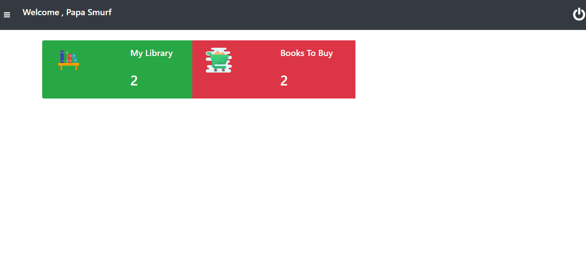
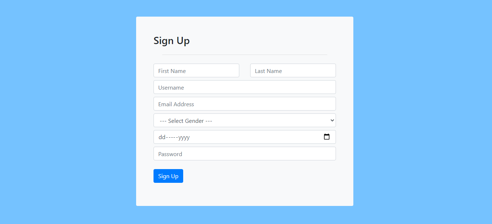
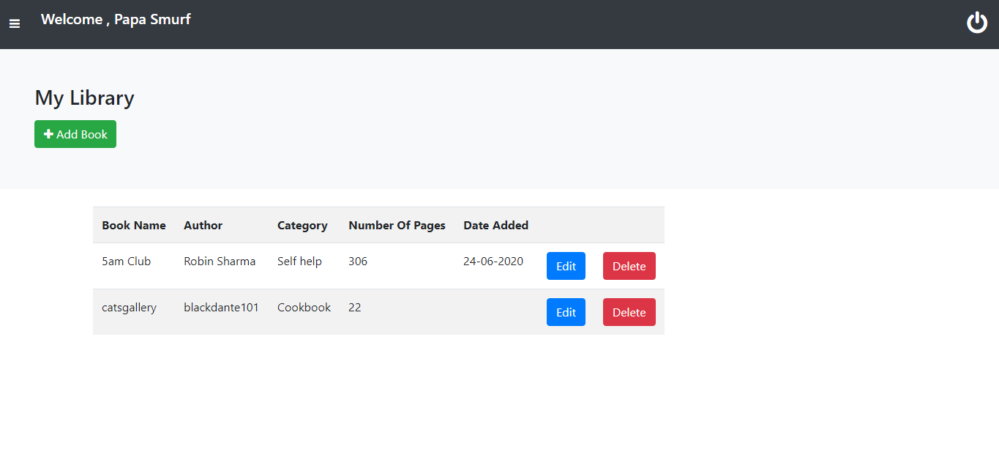
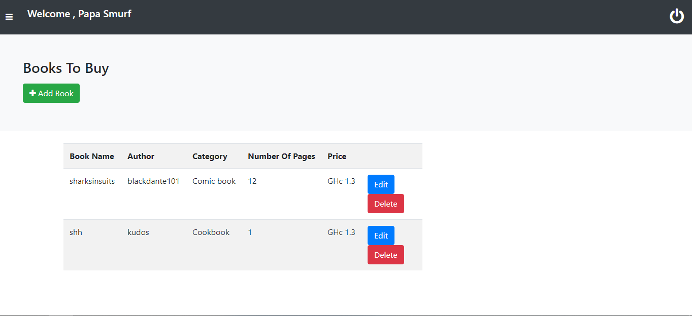

# book_app with phpmysql
a web app which the user can manage the library and can view friends library

- login and signup authentication included 

The Role Of Each User 

- Add,Edit,Delete Books In Library

- View Friends Library

you need to create a database called book_app before importing book_app.sql

# Viewing Friend Library

# Homepage Demo

# Sign Up Demo

# Sign In Demo

# Dashboard Demo

# My Library Demo

# Books To Buy Demo

